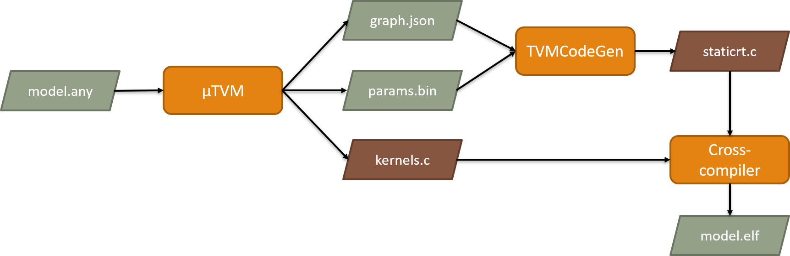

# µTVM StaticRT CodeGen

This project contains a code generator that produces static C NN inference deployment code targeting tiny micro-controllers (TinyML) as replacement for other µTVM runtimes. This tools generates a runtime, which statically executes the compiled model.  This reduces the overhead in terms of code size and execution time compared to having a dynamic on-device runtime.

## Requirements

- Install required system packages
- Install required python packages
- Clone TVM
- Apply patches in `tvm_patches/`
- Build TVM

For detailed commands see [CI Config](.github/workflows/ci.yml).

## Building

The generator is a conventional CMake project.

    mkdir build && cd build
    cmake ..
    cmake --build .

## Usage

- Point python to the TVM installation:

      export PYTHONPATH=../tvm/python:${PYTHONPATH}

- Generate a `graph.json`, `params.bin` and `kernels.c` file for your model with µTVM. A complete example is shown in [this µTVM example script](examples/utvm_gen_graph_and_params.py).

- Inspect `kernels.c` and determine the required workspace size by looking at the `TVMBackendAllocWorkspace` calls and picking the largest used byte size. If there are no calls, the size should be zero.

- Execute the µTVM StaticRT CodeGen:

      ./utvm_staticrt_codegen graph.json params.bin staticrt.c $WORKSPACE_SIZE

- Now the `kernels.c` and `staticrt.c` can be compiled together with some calling code into a complete application. An example is given in `examples/target_src/`.

For detailed commands see [example full flow script](examples/run_flow.sh).
